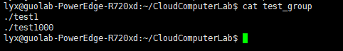
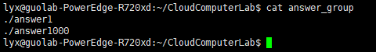
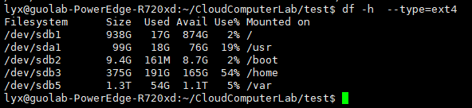
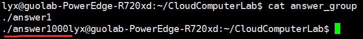
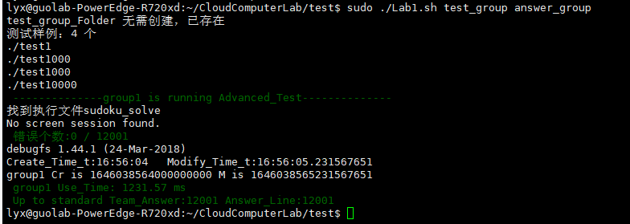

# Lab 1: “Super-fast” Sudoku Solving

Enter in the folder you have cloned from our lab git repo, and pull the latest commit. 

`git pull`

You can find this lab1's instruction in `Lab1/README.md` 

All materials of lab1 are in folder `Lab1/`

## 1. Overview

Implement a Sudoku solving program, using multiple threads or multiple processes, running on a single machine. Try to **utilize all your CPU cores** and make your program **run as fast as possible**! 

### Goals

* Practice basic parallel programming skills, such as using multiple threads/processes;
* Get familiar with Unix OS environment development (eg., file I/O, get timestamp);
* Get familiar with source code version control tools (git), and learn to collaborate with others using github;

## 2. Background

### 2.1 Introduction to Sudoku

Sudoku (originally called Number Place) is a logic-based combinatorial number-placement puzzle. 

You are given a 9×9 board of 81 squares logically separated into 9 columsn, 9 rows, and 9 3×3 subsquares. The goal is, given a board with some initial numbers filled in (we call it a **Sudoku puzzle**), fill in the rest of the board so that every column, row, and subsquare have all the digits from 1 to 9 and each digit appears only once (we call it a **Sudoku solution**).


 <u>An example Sudoku puzzle:</u>


 <u>An example Sudoku solution to above puzzle:</u>


### 2.2 Some useful resources

If you have no idea about what algorithms can be used to solve Sudoku puzzles, we suggest you read [this](https://rafal.io/posts/solving-sudoku-with-dancing-links.html). To simplify your work, we have provided a simple [implementation](src/Sudoku/) `(Lab1/src/Sudoku`) of 4 Sudoku solving algorithms (some are slow, some are fast), but without using multiple threads/processes. The two files *test1* and *test1000* contain many puzzles for you to test. 

Of course, you are always encouraged (not mandatory) to implement those algorithms by yourselves and even your own algorithms (if you have time).

## 3. Your Lab Task

### 3.1 Write a program 

Implement a program which satisfies the following requirements:

#### 3.1.1 Program input and output

##### **Input** 

1. When executing the compiled program from the code you submit, it must **<u>not</u>** take any parameters and the program must be named ***sudoku_solve***. In other words, your program can be run normally by typing `./sudoku_solve` in the terminal.
2. But after start, your program needs to be able to read multiple strings from ***stdin***, which are separated by line breaks. The content of these strings are **the paths of the Sudoku puzzles files**.
3. In each input file, **each line** of the file represents a Sudoku puzzle that needs to be solved. Each line contains 81 digits, where the first 9 digits represent the first row of the Sudoku puzzle, the 10th to the 18th digits represent the second row of the puzzle, and so on. The digit 0 represents a blank that needs to be filled in when solving the puzzle.

**3.1.1.1 Puzzle file example**

In the following image, we have printed three Sudoku puzzle **files** in the terminal. They contain one, two, and three puzzles, and their names are test1, test2, and test3.


**3.1.1.2 Example input from terminal**

In the following code snippet, we showed how to input Sudoku puzzle files that need to be solved from the terminal after your program starts running:

```
./test1 
./test2
./test3
```

##### Output

For each Sudoku puzzle in file, your program should only output the solution to the puzzle to ***stdout***. The format of the solution should be the same as the puzzle, except that all 0s in the puzzle should be replaced with the correct numbers. Also, remember that the order of the answers should be consistent with the order of the input Sudoku puzzles.

**3.1.1.3 Example output**

```
312647985786953241945128367854379126273461859691285473437592618569814732128736594
693784512487512936125963874932651487568247391741398625319475268856129743274836159 
869725413512934687374168529798246135231857946456319872683571294925483761147692358
693784512487512936125963874932651487568247391741398625319475268856129743274836159
364978512152436978879125634738651429691247385245389167923764851486512793517893246
378694512564218397291753684643125978712869453859437261435971826186542739927386145
```

**3.1.1.4 Output order requirement**

Taking the three test files above as an example, your program needs to output the result of `./test1` first, then `./test2`, and finally `./test3`. Additionally, the order of answers corresponding to each file should be consistent with the order of puzzles in the file.

In the example output, the 1st line corresponds to the solution of the Sudoku puzzle in `./test1`. The 2nd and 3rd lines correspond to the 1st and 2nd puzzles in `./test2`. The 4th, 5th, and 6th lines correspond to the 1st, 2nd, and 3rd puzzles in test3.

#### 3.1.2 Implementation requirements 

##### 3.1.2.1 Basic version

Your program should be able to: 

1.  Accept **one** input file name, and the size of the input file is smaller than 100MB. 
2.  Successfully solve the puzzles in the input file, and output the results in the format described before.
3.  Use multiple threads/processes to make use of most of your machine's CPU cores.

\[Tips\]: 

1. Use an event queue to dispatch tasks and merge results to/from worker threads.
2. Dynamically detect how many CPU cores your machine has to determine how many threads/processes your program should use.
3. Be careful about contention between multiple threads/processes.

##### 3.1.2.2 Advanced version

Your program should be able to: 

1. Complete all the requirements in the basic version.
2. Accept **any number of** input file names, and the size of input file can be **any large** (as long as it can be stored on your disk)
3. When the program is solving puzzles in the previously input file(s), the program can **meanwhile accept more input file names from *stdin***.

\[Tips\]: 

1. Use a dedicated thread to accept input.
2. To avoid exhausting all memory, read different parts of the file into memory and solve them one by one.
3. You are encouraged to try more optimizations, such as cache coherency processing.

### 3.2. Test script

We have provided a script for you to use so that you can test your program before submitting, you can use this shell script on most Linux systems.

It will verify the correctness of the program based on the output, and show you the time your program takes.

##### 3.2.1 Get prepared

1. This script requires you to provide **two input files**. These two files need to be placed in the **same directory as the script**. The following describes how to prepare these two input files:

   a. The content of the **first file** is a list of Sudoku puzzle files which will be input to your program.  For example, we name the first file as `test_group`, and we prepared 2 puzzle files(see in 3.1.1.1) to test our program, the first file is named as "test1" and it has 1 puzzle to be solved, and the other file is named "test1000" and it has 1000 puzzles to be solved. Then the content format of `test_group` is as follows:

   

   b.  The content of the **second file** is a list of Sudoku solution files to the puzzles you prepared. Take the example of the first file above,  we name the second file as `answer_group`. Same to the `test_group` above, `answer_group` should also contain 2 answer files, the first answer file corresponds to ""test1"" in `test_group`,  it's named "answer1" and it has 1 solution, the second answer file corresponds to "test1000" in `test_group`, it's name is "answer1000" and it has 1000 solutions. Then the content format of `answer_group` is as follows:

   

   You can create your own test files and put them in the test group and answer group if you want.

2. Using this script requires installing the `screen` command. You can use the `which screen` command to check if `screen` is installed on your local machine. If it is not installed, you can install it using the following command:
```shell
		ubuntu(debian): sudo apt-get install screen 	#This or apt
										sudo apt install screen 		#This or apt-get
		centos(redhat): yum install screen	2.
```
3. The compiled executable file should be named  **sudoku_solve**, and it need to be placed in the  **same directory as this script**.

4. If your file system is not in the **ext4** format, this script may not be able to do performance tests successfully and can only do basic tests. You can use the following command to check which paths are mounted on an exf4-formatted disk:

   ```shell
   	df -h --type=ext4
   ```

   

5. The script will generate a sub-folder contains two files named Basic(Advanced)_Result and Basic(Advanced)_Answer, the Result file contains your program's output and the Answer file contains reference output. The script will delete these two folders every time it runs, so if you need the data, make sure to copy them before running the script. 

6. The script presents the time spent as relative, and there is a relatively fixed processing time for each run. For example, if your program takes 1300ms to solve a Sudoku problem, but the script takes 800ms for preparation, the final display will show 2100 milliseconds. Additionally, everyone's configuration and performance are different, resulting in different times. This means that you only need to keep optimizing on your own machine instead of comparing with others. Rest assured that the same environment will be used for the final scoring.

7. (**Very important**) If you want to get a high score (script test), it is better to flush the data in the buffer in time.

##### 3.2.2 Script Usage

```shell
		sudo  ./Lab1.sh  test_group answer_group
```

The script takes two parameters, they are the 2 prepared files in 3.2.1.

Note that this output below means that you are missing a line break at the end of your answer group, which will not be recognized. Of course, the path of your puzzle file should be in the same order as the answer path.



An example：



## 4. Lab submission

Please put all your code in folder `Lab1` and write a `Makefile` so that we **can compile your code in one single command** `make`. The compiled runnable executable binary should be named `sudoku_solve` and located in folder `Lab1`. If you do not know how to write `Makefile`, you can find a simple example in `Lab1/src/Sudoku`. Please carefully following above rules so that TAs can automatically test your code!!!

Please submit your lab program and performance test report following the guidance in the [Overall Lab Instructions](../README.md) (`../README.md`)

## 5. Grading standards

1. You can get 38 points if you can: 1) finish all the requirements of the basic version, and 2) your performance test report has finished the two requirements described before. If you missed some parts, you will get part of the points depending how much you finished
2. You can get 40 points (full score) if you can: 1) finish all the requirements of the advanced version, and 2) your performance test report has finished the two requirements described before. If you missed some parts, you will get part of the points depending how much you finished.

