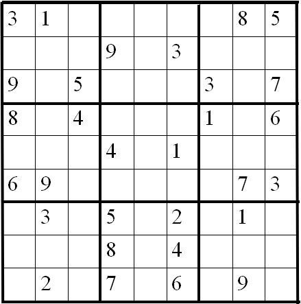
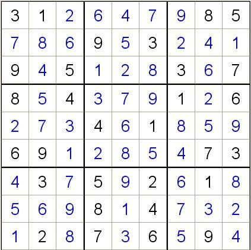
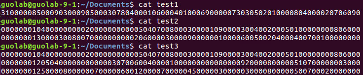

# Lab 1: “Super-fast” Sudoku Solving

Enter in the folder you have cloned from our lab git repo, and pull the latest commit. 

`git pull`

You can find this lab1's instruction in `Lab1/README.md` 

All materials of lab1 are in folder `Lab1/`

## 1. Overview

Implement a Sudoku solving program, using multiple threads or multiple processes, running on a single machine. Try to **utilize all your CPU cores** and make your program **run as fast as possible**! 

### Goals

* Practice basic parallel programming skills, such as using multiple threads/processes;
* Get familiar with Unix OS environment development (eg., file I/O, get timestamp);
* Get familiar with source code version control tools (git), and learn to collaborate with others using github;
* Practice how to do performance test and write a high-quality performance test report.

## 2. Background

### 2.1 Introduction to Sudoku

Sudoku (originally called Number Place) is a logic-based combinatorial number-placement puzzle. 

You are given a 9×9 board of 81 squares logically separated into 9 columsn, 9 rows, and 9 3×3 subsquares. The goal is, given a board with some initial numbers filled in (we call it a **Sudoku puzzle**), fill in the rest of the board so that every column, row, and subsquare have all the digits from 1 to 9 and each digit appears only once (we call it a **Sudoku solution**).


 <u>An example Sudoku puzzle:</u>



 <u>An example Sudoku solution to above puzzle:</u>



### 2.2 Some useful resources

If you have no idea about what algorithms can be used to solve Sudoku puzzles, we suggest you read [this](https://rafal.io/posts/solving-sudoku-with-dancing-links.html). To simplify your work, we have provided a simple [implementation](src/Sudoku/) `(Lab1/src/Sudoku`) of 4 Sudoku solving algorithms (some are slow, some are fast), but without using multiple threads/processes. The two files *test1* and *test1000* contain many puzzles for you to test. 

Of course, you are always encouraged (not mandatory) to implement those algorithms by yourselves and even your own algorithms (if you have time).

## 3. Your Lab Task

### 3.1 Write a program 

Implement a program which satisfies the following requirements:

#### 3.1.1 Program input and output

##### **3.1.1.1 Input** 

1. Your program **<u>must</u>** have no arguments during start. Attention, your program must be called *sudoku_solve*,  just typing `./sudoku_solve` and your program will run correctly.
2. But after start, your program should be able to read multiple strings from ***stdin***, where each string is separated by a line-break. Each string is a **name of a file**, which contains one or more Sudoku puzzles that your program is going to solve. 
3. In the input file, **each line** is a Sudoku puzzle that needs to be solved. Each line contains 81 decimal digits. The 1st-9th digits are the 1st row of the 9×9 grid, and the 10th-18th digits are the 2nd row of the 9×9 grid, and so on. Digit 0 means this digit is unknown and your program needs to figure it out according to the Sudoku rules described above.

**Example contents**



**Example input**

```
./test1 
./test2
./test3
```

##### 3.1.1.2 Output

For each test case, you just only output the Sudoku solutions. And don't forget, the output order should correspond with the input order of Sudoku puzzles.

**Example output**

```
312647985786953241945128367854379126273461859691285473437592618569814732128736594
693784512487512936125963874932651487568247391741398625319475268856129743274836159 
869725413512934687374168529798246135231857946456319872683571294925483761147692358
693784512487512936125963874932651487568247391741398625319475268856129743274836159
364978512152436978879125634738651429691247385245389167923764851486512793517893246
378694512564218397291753684643125978712869453859437261435971826186542739927386145
```

**Output order requirement**

In the example of input above, the order of filename entered is `./test1`, `./test2` and `./test3`. So, you should output the solutions of Sudoku puzzles in file `test1` firstly, then file `test2` and finally file `test3`. Needless to say, the solutions should be outputed in the same sequence as the puzzles are inputted in.

In the example of output above, the 1st line is the solution of Sudoku puzzle in file `test1`. After that, the 2nd line and 3rd line are the solutions of 1st and 2nd Sudoku puzzles in file `test2`. Finally, the 4th line, 5th line and 6th line are the solutions of 1st, 2nd and 3rd Sudoku puzzles in file `test3`. 

#### 3.1.3 Implementation requirements 

##### 3.1.3.1 Basic version

Your program should be able to: 

1.  Accept **one** input file name, and the size of the input file is smaller than 100MB. 
2.  Successfully solve the puzzles in the input file, and output the results in the format described before.
3.  Use multiple threads/processes to make use of most of your machine's CPU cores.

\[Tips\]: 1) Use event queue to dispatch tasks and merge results to/from worker threads. 2) Dynamically detect how many CPU cores are there on your machine, in order to decide how many threads/processes your program uses. 3) Be careful about the contention among multiple threads/processes

##### 3.1.3.2 Advanced version

Your program should be able to: 

1. Complete all the requirements in the basic version.
2. Accept **any number of** input file names, and the size of input file can be **any large** (as long as it can be stored on your disk)
3. When the program is solving puzzles in the previously input file(s), the program can **meanwhile accept more input file names from *stdin***.

\[Tips\]: 1) Use a dedicated thread to accept input; 2) To avoid consuming all the memory, read different parts of the file into memory and solve them one by one; 3) You are encouraged to try more optimizations such as cache coherency processing.

### 3.2. Test script

You can test your program using the script (Lab1.sh) that comes with this Lab.

##### 3.2.1 Notes：

1. You can use the script on most Linux environments

2. Requires support for the **screen** command

​		You can use "***which screen***" to see if the screen command is already installed, if not you can refer to the following command download:

```shell
		ubuntu: apt-get install screen

		centos: yum install screen
```

3. The executable file can only be named **sudoku_solve**

4. sudoku_solve executable file, Lab1.sh script should be placed in the same directory

5. If your file system is not in **ext4** format, the performance test may not succeed and only the basic test can be performed.

   ​	You can see which path mounted ext4 disks  in the following way: 

   ```shell
   	df -h --type=ext4
   ```

   

6. The script will generate a subfolder with Basic(Advanced)\_Result and Basic(Advanced)_Answer, Result is your output and Answer is the reference output. At each run, the script will delete the two files , so if you need this data, please copy it first before running the script.

7. The time taken for script presentation is relative, each time there will be a relatively fixed processing time. For example, your program used 1300ms to solve the sudoku problem, but the script preparation took 800ms. eventually, the script will show 2100ms. Also everyone's configuration and performance is different, resulting in different times, which means you only need to keep optimizing on your machine, not comparing it with others. Please be assured that the same environment will be used for the final scoring.

8. (**Very important**) If you want to get a high score (script test), it is better to flush the data in the buffer in time.

##### 3.2.2 Script Usage

```shell
		sudo  ./Lab1.sh  test_group answer_group
```

Parameter explanation：

​		The script takes two parameters	

​		Para1(For example: test_group ) : A file that create by yourself. This file is placed in the path of the different test files. For example, if the test file group contains: . /test1 . /test1000 two input test files, the structure is as follows：


​		Para2(For example: answer_group) : A file like parameter 1 but with the path to the answer to the test file. For example, if the test file group contains: . /test1 . /test1000 two input test files, the answer file group contains: . /answer1 . /answer1000 , and the structure is as follows：


You can create your own test files and put in the combinations you want.

Note that this output below means that you are missing a line break at the end of your test file, which will not be recognized. Of course, the path of your answer file should be in the same order as the test path.


An example：


## 4. Lab submission

Please put all your code in folder `Lab1` and write a `Makefile` so that we **can compile your code in one single command** `make`. The compiled runnable executable binary should be named `sudoku_solve` and located in folder `Lab1`. If you do not know how to write `Makefile`, you can find a simple example in `Lab1/src/Sudoku`. Please carefully following above rules so that TAs can automatically test your code!!!

Please submit your lab program and performance test report following the guidance in the [Overall Lab Instructions](../README.md) (`../README.md`)

## 5. Grading standards

1. You can get 38 points if you can: 1) finish all the requirements of the basic version, and 2) your performance test report has finished the two requirements described before. If you missed some parts, you will get part of the points depending how much you finished
2. You can get 40 points (full score) if you can: 1) finish all the requirements of the advanced version, and 2) your performance test report has finished the two requirements described before. If you missed some parts, you will get part of the points depending how much you finished.

