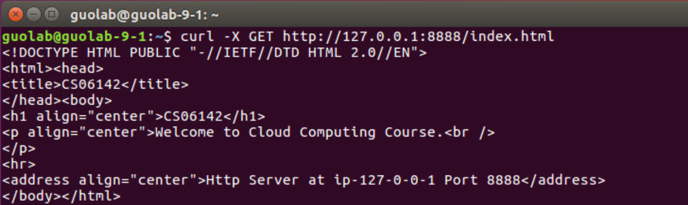
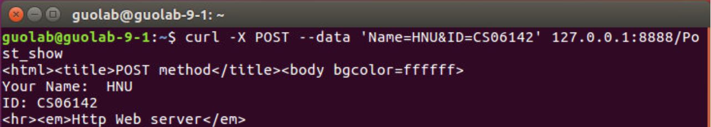
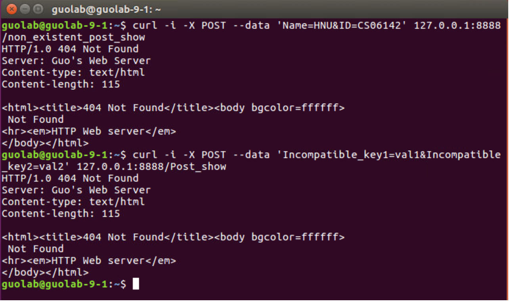
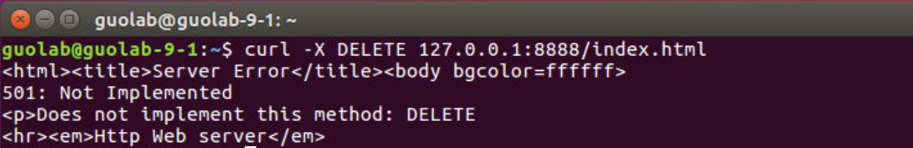

# Lab2: Your Own HTTP Server

*Some materials are from Homework 2 of CS162 2019 at UC Berkeley.* *Thanks to CS162!* 

Enter in the folder you have cloned from our lab git repo, and pull the latest commit. 

`git pull`

You can find this lab2's instruction in `Lab2/README.md` 

All materials of lab2 are in folder `Lab2/`

## 1. Overview

Implement an HTTP server based on HTTP/1.1 from scratch by your own, using network programming knowledges learned from our class. Also, try to use high concurrency programming skills learned from the class to guarantee the web server's performance.

### Goals

* Practice basic network programming skills, such as using socket API, parsing packets;
* Get familiar with robust and high-performance concurrent programming.

## 2. Background

### 2.1 Hypertext Transport Protocol

The Hypertext Transport Protocol (HTTP) is the most commonly used application protocol on the Internet today. Like many network protocols, HTTP uses a client-server model. An HTTP client opens a network connection to an HTTP server and sends an HTTP request message. Then, the server replies with an HTTP response message, which usually contains some resource (file, text, binary data) that was requested by the client. We briefly introduce the HTTP message format and structure in this section for your convenience. Detailed specification of HTTP/1.1 can be found in [RFC 2616 - Hypertext Transfer Protocol -- HTTP/1.1](https://tools.ietf.org/html/rfc2616).

### 2.2 HTTP Messages

HTTP messages are simple, formatted blocks of data. All HTTP messages fall into two types: **request** messages and **response** messages. Request messages request an action from a web server. Response messages carry results of a request back to a client. Both request and response messages have the same basic message structure.

#### 2.2.1 Message Format 

HTTP request and response messages consist of 3 components: 

- a start line describing the message, 
- a block of headers containing attributes, 
- and an optional body containing data.

Each component has the format as following

##### 2.2.1.1 Start Line

All HTTP messages begin with a start line. The start line for a request message says *what to do*. The start line for a response message says *what happened*.

Specifically, the start line is also called ***Request line*** in *Request messages* and ***Response line*** in *Response messages*.

1. **Request line:** The request line contains a method describing what operation the server should perform and a request URL describing the resource on which to perform the method. The request line also includes an HTTP version tells the server what dialect of HTTP the client is speaking. All of these fields are separated by whitespace.

Example of request line:

`GET /index.html HTTP/1.1`

2. **Response line:** The response line contains the HTTP version that the response message is using, a numeric status code, and a textual reason phrase describing the status of the operation.

Example of response line:

`HTTP/1.1 200 OK`

##### 2.2.1.2 Header

Following the start line comes a list of zero, one, or many HTTP header fields. HTTP header fields add additional information to request and response messages. They are basically just lists of name/value pairs. Each HTTP header has a simple syntax: a name, followed by a colon (:), followed by optional whitespace, followed by the field value, followed by a CRLF.

HTTP headers are classified into: General headers, Request headers, Response headers, Entity headers and Extension headers. Note that request-header fields are different from the response-header fields. We will not introduce those fields in details and you are not required to implement in this lab. You can find them in [RFC 2616 - Hypertext Transfer Protocol -- HTTP/1.1](https://tools.ietf.org/html/rfc2616).

Example of headers in a request:

```
Host: 127.0.0.1:8888
User-Agent: Mozilla/5.0 (X11; Ubuntu; Linux x86_64; rv:74.0) Gecko/20100101 Firefox/74.0
Accept: text/html,application/xhtml+xml,application/xml;q=0.9,image/webp,*/*;q=0.8
Accept-Language: en-US,en;q=0.5
Accept-Encoding: gzip, deflate
Connection: keep-alive
Upgrade-Insecure-Requests: 1
Cache-Control: max-age=0
								     // CRLF
```

Example of headers in a response:

```
Server: Guo's Web Server
Content-length: 248
Content-type: text/html
									// CRLF
```

##### 2.2.1.3 Entity Body

The third part of an HTTP message is the optional entity body. Entity bodies are the payload of HTTP messages. They are the things that HTTP was designed to transmit.

HTTP messages can carry many kinds of digital data: images, video, HTML documents, software applications, credit card transactions, electronic mail, and so on.

Example of entity body:

```
<html><head>
<title>CS06142</title>
</head><body>
<h1>CS06142</h1>
<p>Welcome to Cloud Computing Course.<br />
</p>
<hr>
<address>Http Server at ip-127-0-0-1 Port 8888</address>
</body></html>
```

#### 2.2.2 Structure of HTTP Request

A HTTP request message contains an HTTP request line (containing a method, a query string, and the HTTP protocol version), zero or more HTTP header lines and a blank line (i.e. a CRLF).

 Example of HTTP request message:

```
GET /index.html HTTP/1.1   
Host: 127.0.0.1:8888
User-Agent: Mozilla/5.0 (X11; Ubuntu; Linux x86_64; rv:74.0) Gecko/20100101 Firefox/74.0
Accept: text/html,application/xhtml+xml,application/xml;q=0.9,image/webp,*/*;q=0.8
Accept-Language: en-US,en;q=0.5
Accept-Encoding: gzip, deflate
Connection: keep-alive
Upgrade-Insecure-Requests: 1
Cache-Control: max-age=0
								     // CRLF
```

#### 2.2.3 Structure of HTTP Response

A HTTP response message contains an HTTP response status line (containing the HTTP protocol version, the status code, and a description of the status code), zero or more HTTP header lines, a blank line (i.e. a CRLF by itself) and the content requested by the HTTP request.

Example of HTTP response message:

```
HTTP/1.1 200 OK  					
Server: Tiny Web Server
Content-length: 248
Content-type: text/html
									// CRLF
<html><head>
<title>CS06142</title>
</head><body>
<h1>CS06142</h1>
<p>Welcome to Cloud Computing Course.<br />
</p>
<hr>
<address>Http Server at ip-127-0-0-1 Port 8888</address>
</body></html>
```

### 2.3 HTTP Proxy

HTTP proxy servers are intermediaries. Proxies sit between clients and servers and act as "middlemen", shuffling HTTP messages back and forth between the parties.

HTTP proxy servers are middlemen that fulfill transactions on the client's behalf. Without a HTTP proxy, HTTP clients talk directly to HTTP servers. With a HTTP proxy, the client instead talks to the proxy, which itself communicates with the server on the client's behalf.

HTTP proxy servers are both web servers and web clients. Because HTTP clients send request messages to proxies, the proxy server must properly handle the requests and the connections and return responses, just like a web server. At the same time, the proxy itself sends requests to servers, so it must also behave like a correct HTTP client, sending requests and receiving responses.

The working pattern of HTTP proxy is shown in the following figure:

```
                               +-----------+               +-----------+
                               |           |               |           |
   +----------+    Request     |           |   Request     |           |
   |          |+--------------->           |+-------------->           |
   |  Client  |                |   Proxy   |               |   Server  |
   |          <---------------+|           <--------------+|           |          
   +----------+	   Response    |           |   Response    |           |          
                               |           |               |           |
                               +-----------+               +-----------+
```

## 3. Your Lab Task

### 3.1 Implement your own HTTP Server

In this Lab, we won't provide any basic code. So, you should implement a HTTP server (base on HTTP/1.1) from scratch which satisfies the following requirements:

#### 3.1.1 HTTP Server Outline

From a network standpoint, your HTTP server should implement the following:

1. Create a listening socket and bind it to a port
2. Wait a client to connect to the port
3. Accept the client and obtain a new connection socket
4. Read in and parse the HTTP request
5. Start delivering services: 1) Handle HTTP GET/POST request and return an error message if an error occur. 2) Proxy the request to another HTTP server (optional for advanced version).

The server will be in either non-proxy mode or proxy mode (we have introduced the proxy in section `2.3`). It does not do both things at the same time.

#### 3.1.2 Handle HTTP request

In this Lab, **you just need to implement the GET method and the POST method in your HTTP server**. That is to say, if your HTTP server receive a HTTP request but the request method is neither GET nor POST. The HTTP server just need to return a 501 Not Implemented error message (a response message with Response line having status code to be 501, see `2.2`). 

There is no need to handle the header line(s) in the request (but you need to recognize it so that you will not mix it with the next request's start line). Also, you are free to fill any (or zero) header line(s) in the HTTP response.

##### 3.1.2.1 Handle HTTP GET request

The HTTP server should be able to handle HTTP GET requests for html pages. 

1. If the HTTP request’s path corresponds to a html page file, respond with a 200 OK and the full contents of the file. For example, if GET /index.html is requested, and a file named index.html exists in the files directory. You should also be able to handle requests to files in subdirectories of the files directory (e.g. GET /images/hero.jpg). 
2. If the HTTP request’s path corresponds to a directory and the directory contains an `index.html` file, respond with a 200 OK and the full contents of the index.html file in that folder.
3. If the requested page file does not exist, or the requested directory does not contain an `index.html` file, return a 404 Not Found response (the HTTP body is optional).

See examples in section `3.1.7.1`.


##### 3.1.2.2 Handle HTTP POST request

The HTTP server should be able to handle HTTP POST requests. In this lab, the way of handle HTTP POST is very simple. 

1. You should construct an HTTP POST request (see section `3.1.7.2`) that contains 2 keys: "Name" and "ID" (please fill in your name and student number respectively), and send the POST request to `/Post_show` (i.e. `http://127.0.0.1:8888/Post_show` if server's IP is `127.0.0.1` and service port is `8888`).

Then, if the HTTP server receive this POST request (the request URL is `/Post_show` and the keys are "Name" and "ID"), respond with a 200 OK and echo the "Name"-"ID" pairs you have sent.

2. Otherwise (i.e. the request URL is not `/Post_show` or the keys are not "Name" and "ID"), return a 404 Not Found response message. 

See examples in section `3.1.7.2`.

##### 3.1.2.3 Other request

Just return 501 Not Implemented error message for other request method (e.g. DELETE, PUT, etc.).

See examples in section `3.1.7.3`.

#### 3.1.3 Implement a proxy server (optional)

Enable your server to proxy HTTP requests to another HTTP server and forward the responses to the clients.

1. You should use the value of the `--proxy` command line argument, which contains the address and port number of the upstream HTTP server.
2. Your proxy server should wait for new data on both sockets (the HTTP client fd, and the upstream HTTP server fd). When data arrives, you should immediately read it to a buffer and then write it to the other socket. You are essentially maintaining 2-way communication between the HTTP client and the upstream HTTP server. Note that your proxy must support multiple requests/responses.
3. If either of the sockets closes, communication cannot continue, so you should close the other socket and exit the child process.

Hints: 1) This is more tricky than writing to a file or reading from stdin, since you do not know which side of the 2-way stream will write data first, or whether they will write more data after receiving a response. 2) You should again use threads for this task. For example, consider using two threads to facilitate the two-way communication, one from A to B and the other from B to A.

#### 3.1.4 Use multi-thread to increase concurrency

Your HTTP server should use multiple threads to handle as many concurrent clients' requests as possible. You have at least the following three options to architect your multi-thread server:

- **On-demand threads**.  You can can create a new thread whenever a new client comes in, and use that thread to handle all that clients' task, including parsing the HTTP request, fetching page files, and sending response. The thread can be destroyed after that client finishes, e.g, detect through TCP `recv()`.  However,it may not be easy to detect client finish in the HTTP layer.
- **A pool of always-on threads**. You can use a fixed-sized thread pool in your HTTP server program for handling multiple client requests concurrently. If there are no tasks, those threads are in a waiting state. If a new client comes in, assign a thread to handle the client's request and send response to it. If the assigned thread is busy, you can use a work queue to buffer the request, and let the thread process it later.  
- **Combined**. Combine above two styles together. For example, you can use thread pool to receive request and send response, and use on-demand threads to fetch large page files.  

Feel free to choose any one from the above three, or use other multi-thread architecture that you think is cool.

#### 3.1.5 Specify arguments

Your program should enable long options to accept arguments and specify those arguments during start. They are `--ip`, `--port`,  and `--proxy` (optional).

1. `--ip`&ensp;&ensp;&ensp;&ensp;&ensp;&ensp;&ensp;&ensp;&ensp;&ensp;&ensp;&ensp; —— Specify the server IP address.
2. `--port`&ensp;&ensp;&ensp;&ensp;&ensp;&ensp;&ensp;&ensp;&ensp;&ensp; —— Selects which port the HTTP server listens on for incoming connections.
4. `--proxy`&ensp;&ensp;&ensp;&ensp;&ensp;&ensp;&ensp;&ensp; —— Selects an “upstream” HTTP server to proxy. The argument can have a port number after a colon (e.g. `https://www.CS06142.com:80`). If a port number is not specified, port 80 is the default.

If you have no idea about *long options*, you can read [this](https://www.gnu.org/software/libc/manual/html_node/Argument-Syntax.html#Argument-Syntax). And you may need to use some functions like `getopt_long()`, `getopt_long_only()`, `getopt()` and so on. Check those function's usage with the `man` command.

#### 3.1.6 Run your HTTP Server

Your program should be able to start at terminal. If your program is called *httpserver*, just typing:

in the non-proxy mode: 

`./httpserver --ip 127.0.0.1 --port 8888 --number-thread 8` 

It means that your HTTP server's IP address is 127.0.0.1 and service port is 8888. The --number-thread indicates that there are 8 threads in the thread pool for handling multiple client request concurrently.

in the proxy mode:

`./httpserver --ip 127.0.0.1 --port 8888 --number-thread 8 --proxy https://www.CS06142.com:80`

It means that this is an HTTP proxy. This proxy's IP address is 127.0.0.1 and service port is 8888. And the proxy has a thread pool with 8 threads. The --proxy indicates that the "upstream" HTTP server is `https://www.CS06142.COM:80`. So, if you send a request message to this proxy (i.e. `127.0.0.1:8888`), it will forward this request message to the "upstream" HTTP server (i.e. `https://www.CS06142.com:80`) and forward the response message to the client.

When you run the command above, your HTTP server should run correctly.

#### 3.1.7 Accessing Your HTTP Server

##### 3.1.7.1 Using GET method

1. You can check that your HTTP server works by opening your web browser and going to the appropriate URL. [Note] IP 127.0.0.1 refers to the IP of local host. So you can use 127.0.0.1 to test your HTTP server on the same local machine. 

For example:


You can also send HTTP requests with the curl program. An example of how to use curl is:

`curl -i -X GET http://127.0.0.1:8888/index.html`

For example:



2. If the request page does not exist, your HTTP server should return a 404 Not Found error message.

For example:


##### 3.1.7.2 Using POST method

1. You can check whether the POST method works by sending a HTTP request with the curl program. Typing the command at terminal:

`curl -i -X POST --data 'Name=HNU&ID=CS06142' http://127.0.0.1:8888/Post_show`

For example:



You can also construct a POST HTTP request and send the request to HTTP server using some browser plug-in tools.

2. If the request URL is not `/Post_show` or the keys are not "Name" and "ID"), you will get a 404 Not Found error message.

For example:



##### 3.1.7.3 Other method

The HTTP server will not handle HTTP requests except GET requests and POST requests.

If you send a HTTP DELETE (or PUT, HEAD, etc.) request to delete the specified resource, you will get a 501 Not Implemented error message:



#### 3.1.8 Implementation requirements

##### 3.1.8.1 Basic version

Your program should complete all the **tasks described in section `3.1.1~3.1.7` except `3.1.3`**. 

In the basic version, you have **only one request per TCP connection going on at the same time**. The client waits for response, and when it gets response, perhaps reuses the TCP connection for a new request (or use a new TCP connection). This is also what normal HTTP server supports.

##### 3.1.8.2 Advanced version

Your program should complete all the **tasks described in section `3.1.1~3.1.7` including`3.1.3`**. 

In the advanced version, **multiple http requests can be fired concurrently on one TCP connection**. This is also called HTTP pipelining which is supported by many real browsers and servers (such as Chrome). Note that HTTP requests that come from the same TCP connection should be responded in the same order. So take care the order problem when using complex multi-thread styles. 

### 3.2 Finish a performance test report
Please test your code first, and commit a test report along with your lab code into your group’s course github repo.

The test report should describe the performance result under various testing conditions. Specifically, in your test report, you should at least contain the following two things:

1. Test how many HTTP request your server can process per second, when running on various server machine environments. For example, change the number of server CPU cores, enable/disable hyper-threading, etc. 
2. Test how many HTTP request your server can process per second, by varying the number of concurrent clients that send request to your server simultaneously. Do change the client's workload. For example, test when a client use new TCP connection for a new request, or when a client reuses old TCP connection for new requests. Moreover, if you implement the advanced version, try to change the number of out-bounding requests on the same client's TCP connection. You can write a simple client that send HTTP Get by your own (can run multiple client programs on the same machine to emulate multiple clients), or use some existing HTTP client testing tools such as [ab - Apache HTTP server benchmarking tool](http://httpd.apache.org/docs/current/programs/ab.html). 

**[NOTE]**: Be careful that clients may be the performance bottleneck. So you'd better use multiple machines when testing the performance. For example, you can run multiple client processes on three machines (of three group members), and run the server process on another machine (of the other group member). Moreover, the network can be the bottleneck too. You can estimate the performance limit according to the physical bandwidth of your network environment, and see if your implementation can reach the performance limit. 


## 4. Lab submission

Please put all your code in folder `Lab2` and write a `Makefile` so that we **can compile your code in one single command** `make`. The compiled runnable executable binary should be named `httpserver` and located in folder `Lab2`. Please carefully following above rules so that TAs can automatically test your code!!!

Please submit your lab program and performance test report following the guidance in the [Overall Lab Instructions](../README.md) (`../README.md`)

## 5. Grading standards

1. You can get 23 points if you can: 1) finish all the requirements of the basic version, and 2) your performance test report has finished the two requirements described before. If you missed some parts, you will get part of the points depending how much you finished.
2. You can get 25 points (full score) if you can: 1) finish all the requirements of the advanced version, and 2) your performance test report has finished the two requirements described before. If you missed some parts, you will get part of the points depending how much you finished.