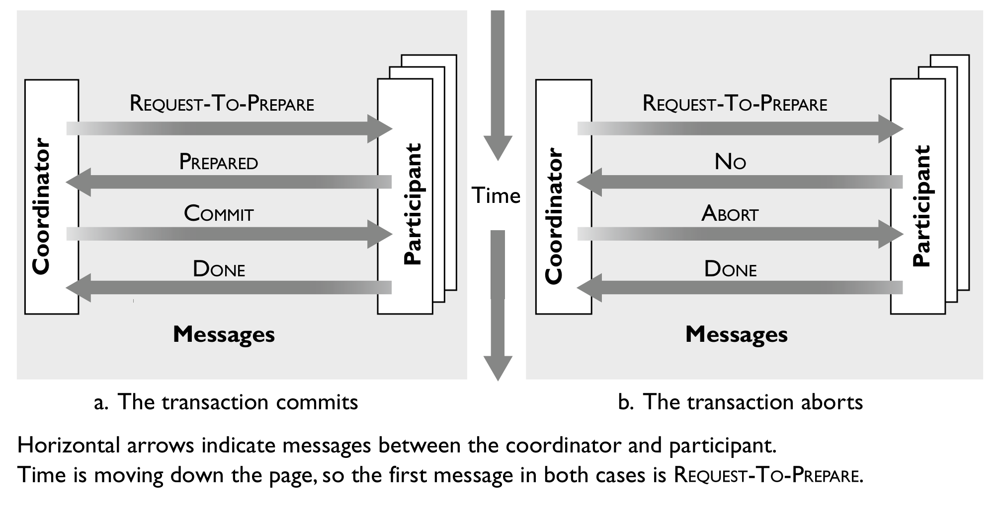

# Lab 3: Your First Distributed System 

Enter in the folder you have cloned from our lab git repo, and pull the latest commit. 

`git pull`

You can find this lab3's instruction in `Lab3/README.md` 

All materials of lab3 are in folder `Lab3/`

## 1. Overview

Implement a distributed system from scratch by your own, using some consensus protocol to guarantee the consistency and robustness of your distributed system.

### Goals

* Learn how to build a distributed system;
* Understand how the consensus protocol works.

## 2. Background

### 2.1 Distributed system

Various definitions of distributed systems have been given in the literature, none of them satisfactory, and none of them in agreement with any of the others. In the most simplest definition, a distributed system is a group of computers working together as to appear as a single computer to the end-user. These machines have a shared state, operate concurrently and can fail independently without affecting the whole system’s uptime. 

### 2.2 Distributed system: consensus protocol

#### 2.2.1 What is consensus protocol

A consensus protocol defines a set of rules for message passing and processing for all networked components to reach agreement on a common subject. A messaging passing rule regulates how a component broadcasts and relays messages while a processing rule defines how a component changes its internal state in face of these messages. As a rule of thumb, we say the consensus is reached when all no-faulty components agree on the same subject.

#### 2.2.2 Why need consensus protocol

Today’s distributed systems such as datacenter systems run in highly dynamic environments. They scale out by leveraging the resources of additional servers, and they grow and shrink according to demand. Server and network failures are also commonplace: according to some investigation, about 2–4% of disk drives fail each year, server scrash about as often, and tens of network links fail everyday in modern datacenters.

As a result, systems must deal with servers coming and going during normal operations. They must react to changes and adapt automatically within seconds; outages that are noticeable to humans are typically not acceptable. This is a major challenge in today’s systems; failure handling, coordination, service discovery, and configuration management are all difficult in such dynamic environments.

Fortunately, Consensus protocol can help with these challenges. Consensus protocol allows a collection of machines to work as a coherent group that can survive the failures of some of its members. Within a consensus group, failures are handled in a principled and proven way. Because consensus groups are highly available and reliable, other system components can use a consensus group as the foundation for their own fault tolerance. Thus, consensus protocol plays a key role in building reliable large-scale software systems.

#### 2.2.3 Two-phase commit

This skeleton describes possibly the simplest, most often used consensus protocol called **two-phase commit**, or **2PC**. As its name suggests, 2PC operates in two distinct phases. The first prepared phase involves proposing a value to every participant in the system and gathering responses. The process that proposes values is called the coordinator and only one coordinator. The second commit-or-abort phase communicates the result of the vote to the participants and tells them either to go ahead and decide or abort the protocol.

The main goal of the protocol is to ensure that a transaction either commits at all the resource managers that it accessed or aborts at all of them. The undesirable outcome that the protocol avoids is that the transaction commits at one resource manager and aborts at another.

***Prepared phase:*** 

1)&ensp;To commit the transaction, the coordinator starts by sending a **REQUEST-TO-PREPARE** message to each
participant.

2)&ensp;The coordinator waits for all participants to "vote" on the request.

3)&ensp;In response to receiving a **REQUEST-TO-PREPARE** message, each participant votes by sending a message back to the coordinator, as follows:

- It votes **PREPARED** if it is prepared to commit.
- It may vote **NO** for any reason, usually because it cannot prepare the transaction due to a local failure.
- It may delay voting indefinitely, for example, because its system is overburdened with other work or because it failed.

***Commit-Or-Abort phase:***

1)&ensp;If the coordinator receives **PREPARED** messages from all participants, it decides to commit. The transaction is now officially committed. Otherwise, it either received a **NO** message or gave up waiting for
some participant, so it decides to abort.

2)&ensp;The coordinator sends its decision to all participants (i.e.,**COMMIT** or **ABORT**).

3)&ensp;Participants acknowledge receipt of the commit or abort by replying **DONE**.

4)&ensp;After receiving **DONE** from all participants, the coordinator can *forget* the transaction, meaning that it can deallocate any memory it was using to keep track of information about the transaction.

### 2.3 In-memory key-value database

An in-memory key-value database is a database that keeps all its data in the random access memory (RAM) and uses a simple key-value data structure. 

There are two key elements in in-memory key-value database: store data in a main memory instead of a disk drive and use a simple key-value method to store data.

***Store data in a main memory:***

Due to the data storage on the main memory, only the main memory is accessed when querying data. This allows for faster access of that data than a disk-based system. Generally, in-memory databases have a number of advantages such as faster transactions, no translation, multi-user concurrency, etc. They are used by applications that depend on rapid response times and real-time data management.

***Use a simple key-value method to store data:***

Key-value stores save data as associative arrays where a single value is associated together with a key used as a signifier for the value. No two keys necessarily need the same structure, so data is simply accumulated into a single, large table.

The client can either get the value for the key, set a value for a key, or delete a key from the data store. The value is a blob that the data store just stores, without caring or knowing what's inside; it's the responsibility of the application to understand what was stored. Since key-value stores always use primary-key access, they generally have great performance and can be easily scaled.

## 3. Your Lab Task

### 3.1 Implement your distributed system

In this lab, you should implement a distributed system with consistency. More specifically, threr are multiple machines in your distributed system, and each machine should have an in-memory key-value database and run the **two-phase commit protocol** to guarantee consistency of these databases. And your servers should supports `SET`, `GET` and `DEL` commands (case sensitive).

Further details are as follows:

#### 3.1.1 Define message format

You should define a message format for client-server communication. RESP (REdis Serialization Protocol) style message format has many advantages such as simple to implement, fast to parse and human readable, etc. So, it is a good choice to use that message format.

To do this simply, in this lab, you should define a **simplified version** of RESP style message format, some details of this message format are as follows:

#### 3.1.1.1 Client request message

Clients send commands to the server using RESP Arrays (more details see `section 3.1.2`). And the RESP Arrays consist of:

- A `*` character as the first byte, followed by the number of elements in the array as a decimal number, followed by CRLF.
- Arbitrary number of bulk strings (up to 512 MB in length).

The bulk string consist of:

- A `$` byte followed by the number of bytes composing the string (a prefixed length), terminated by CRLF.
- The actual string data.
- A final CRLF.

For example, the string `CS06142` is encoded as follows:

`$7\r\nCS06142\r\n`

The bulk string `$7\r\nCS06142\r\n` start with a `$` byte, and the following number 7 indicate that the length of string `CS06142` is 7. Then, the terminated CRLF, actual string data `CS06142` and the final CRLF are next, consecutively.

#### 3.1.1.2 Server response message

1)&ensp;Success message: 

Success messages are encoded in the following way: a plus '+' character, followed by a string that cannot contain a CR or LF character (no newlines are allowed), terminated by CRLF (that is "\r\n").

For example, the `SET` command reply with just "OK" on success (more details see `section 3.1.2`):

`+OK\r\n`

2)&ensp;Error message:

Like success messages, error messages consist of: a minus '-' character, followed by a string, terminated by CRLF.

For example, if an error occurs, just return (more details see `section 3.1.2`):

`-ERROR\r\n` 

3)&ensp;RESP Arrays message

Your server should return an RESP Arrays message when the `GET` command executed successfully (more detail see `section 3.1.2`).

For example:

`*2\r\n$5\r\nCloud\r\n$9\r\nComputing\r\n` 

4)&ensp;Integer message:

Some commands need to return an integer (e.g., `DEL` command, more details see `section 3.1.2`). An integer message is just a CRLF terminated string representing an integer, prefixed by a ":" byte.

An integer message example: 

`:1\r\n`

#### 3.1.2 Implement a in-memory key-value database

Implement an in-memory key-value database that supports `SET`, `GET` and `DEL` commands (case sensitive). And you can use hash table to store the key-value data.

##### 3.1.2.1 SET command

The function of the `SET` command is to set **key** to hold the string **value**. If key already holds a value, it is overwritten. Any previous time to live associated with the key is discarded on successful `SET` operation.

For example, if you want to set key `CS06142` to hold the string `Cloud Computing`, the command would be:

`SET CS06142 "Cloud Computing"`

According to the message format we have discussed in `section 3.1.1`, this command would be encoded as a particular message format:

`*4\r\n$3\r\nSET\r\n$7\r\nCS06142\r\n$5\r\nCloud\r\n$9\r\nComputing\r\n`

**Note:** The encoded message start with a `*` byte. The following number 4 indicate that there are 4 bulk strings in this message. These bulk strings are `$3\r\nSET\r\n`, `$7\r\nCS06142\r\n`, `$5\r\nCloud\r\n`, and `$9\r\nComputing\r\n`. 

Then, send the encoded message to server. If the `SET` operation succeeds, the server will return a success message; otherwise, return an error message.

For example, operation succeeds, just return:

`+OK\r\n`

Otherwise, return:

`-ERROR\r\n`

##### 3.1.2.2 GET command

`GET` command can get the **value** of **key**. If the key does not exist the special value nil is returned. An error is returned if the value stored at key is not a string, because `GET` command only handles string values.

For example, if you want to check the value of the key `CS06142`, construct the command like this:

`GET CS06142`

Like the `GET` command, this command should be encoded as a specific message format before sending to the server. 

`*2\r\n$3\r\nGET\r\n$7\r\nCS06142\r\n`

If the `GET` command was executed correctly, the value (encoded as RESP Arrays format) of the key will be return, or `nil` when the key does no exist. 

For example, if the command above executed correctly, return:

`*2\r\n$5\r\nCloud\r\n$9\r\nComputing\r\n` 

**note:** Because we set the key `CS06142` to hold the string `Cloud Computing` in `section 3.1.1.1`

If the key does no exist, just return:

`*1\r\n$3\r\nnil\r\n`

##### 3.1.2.3 DEL command

The `DEL` command is used for removing the specified **keys** (arbitrary number, up to 512 MB in length). A key is ignored if it does not exist.

The DEL command should return the number of keys that were removed.

For example, if you want to delete some keys that are invalid, you just only construct the `DEL` command:

`DEL CS06142 CS162`

Similar to the `SET` and `GET` commands, the `DEL` command will be encoded, too.

`*3\r\n$3\r\nDEL\r\n$7\r\nCS06142\r\n$5\r\nCS162\r\n`

And the server will return the number of keys that were removed.

For example, if the `DEL` command above executed, return an integer message:

`:1\r\n`

**note:** Because we only set the key `CS06142` to hold a value. As for key `CS612`, it will be ignored bacause it does no exist. So, the number in the interger message is 1.

#### 3.1.3 Implement two-phase commit protocol

There are multiple machines in your distributed system, and each machine hava their own in-memory key-value database. In the complex and unreliable network environment, it is vital that uses some consensus protocol to guarantee the consistency of these databases.

In this lab, you should implement the two-phase commit protocol to ensure that the databases in your distributed system will be consistent.

We have discussed **two-phase commit** in `section 2.2.3`. Now, it is time to put it into practice.

##### 3.1.3.1 Prepared phase

**Coordinator's view:**

1)&ensp;Send **REQUEST-TO-PREPARE** messages to all the participants. 

2)&ensp;Receive **PREPARED** messages from all participants, or receive a **NO** message from at least one participant.

In this step, coordinator is waiting for **PREPARED** or **NO** messages and start a timer. If it does not receive all of them within its timeout period, it can simply abort the transaction, just as if one of the participants had voted **NO**.

**Participant's view:**

1)&ensp;Receive a **REQUEST-TO-PREPARE** message from the coordinator. 

2)&ensp;Send a **PREPARED** message to the coordinator, otherwise send **NO** to the coordinator.

##### 3.1.3.2 Commit-Or-Abort phase

**Coordinator’s view:**

1)&ensp;Depending on the messages received in **prepared phase**, decide to commit or abort.

2)&ensp;Send **COMMIT** or **ABORT** messages to all participants (depending on the decision).

3)&ensp;Receive **DONE** messages from all participants.

In this step, coordinator is waiting for **DONE** messages and start a timer. Nothing important depends on when these messages arrive, so it waits indefinitely for them. If its timeout period expires, it can send reminder messages to the participants to resolicit the  DONE messages.

4)&ensp;Forget the transaction.

**Participant’s view:**

1)&ensp;Receive a decision message, **COMMIT** or **ABORT**.

2)&ensp;Send a **DONE** message.

##### 3.1.3.3 Transfer of coordinator

In a distributed system, it is not uncommon that some components will crash at some time. In your distributed system, when the **coordinator** crash, your system should choose a new one and continue to perform as normal.

In this lab, you just only implement a very simple scenario: 

When a **coordinator** crash occurs, the highest-priority **participant** should send messages to tell other **participants** that he is the new **coordinator**. You can decide the priority of these **participants** base on port number. The lower the port number, the higher the priority.

For example, there are 1 coordinator and 3 participants running on port 8001, 8002, 8003 and 8004 respectively. The participant which run on port 8001 is the highest-priority one. If the coordinator (run on port 8001) is down, the highest-priority will become the new coordinator and send notification messages to the rest 2 participants.    

#### 3.1.4 Run your distributed system

Enable long options to accept arguments in your program, just like the lab2. Required arguments are `--ip`, `--port`, and `--mode`.

The `--ip` and `--port` specify the IP address and the port. As for `--mode`, it indicates that the program your just started is a **coordinator** process or a **participant** process.

If your program is called **kvstore2pcsystem**:

run the **coordinator** process, just typing

`./kvstore2pcsystem --ip 127.0.0.1 --port 8001 --mode coordinator`

run the **participant** process, just typing

`./kvstore2pcsystem --ip 127.0.0.1 --port 8002 --mode participant`

When you run the command above, your program should run correctly.

#### 3.1.5 Implementation requirements

#### 3.1.5.1 Basic version

Your program should complete all the tasks described in `section 3.1.1-3.1.4` except `section 3.1.3.3`.

In basic version, your distributed system will not work properly when the **coordinator** crash. Feel free and it doesn't matter in the basic version.

#### 3.1.5.2 Advanced version

Your program should complete all the tasks described in `section 3.1.1-3.1.4` including `section 3.1.3.3`.

In advanced version, when the **coordinator** crash occurs, your distributed system should choose a new **coordinator** to make sure that the distributed system will keep working properly.

### 3.2 Finish a performance test report

Please test your code first, and commit a test report along with your lab code into your group’s course github repo.

TBC.

## 4. Lab submission

Please put all your code in folder `Lab3` and write a `Makefile` so that we **can compile your code in one single command** `make`. The compiled runnable executable binary should be named `kvstore2pcsystem` and located in folder `Lab3`. Please carefully following above rules so that TAs can automatically test your code!!!

Please submit your lab program and performance test report following the guidance in the [Overall Lab Instructions](../README.md) (`../README.md`)

## 5. Grading standards

1. You can get 23 points if you can: 1) finish all the requirements of the basic version, and 2) your performance test report has finished the two requirements described before. If you missed some parts, you will get part of the points depending how much you finished.
2. You can get 25 points (full score) if you can: 1) finish all the requirements of the advanced version, and 2) your performance test report has finished the two requirements described before. If you missed some parts, you will get part of the points depending how much you finished.