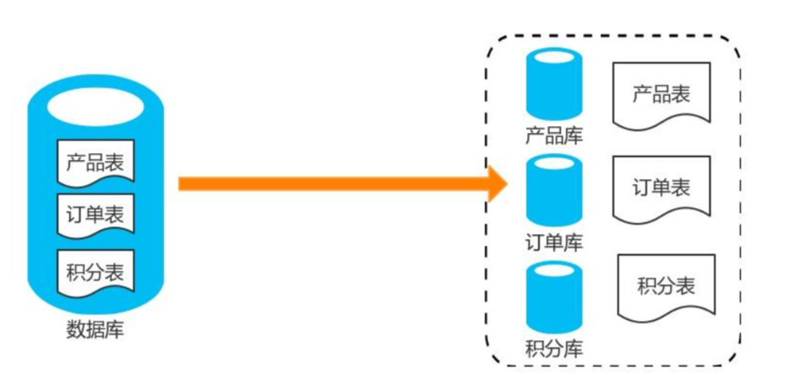
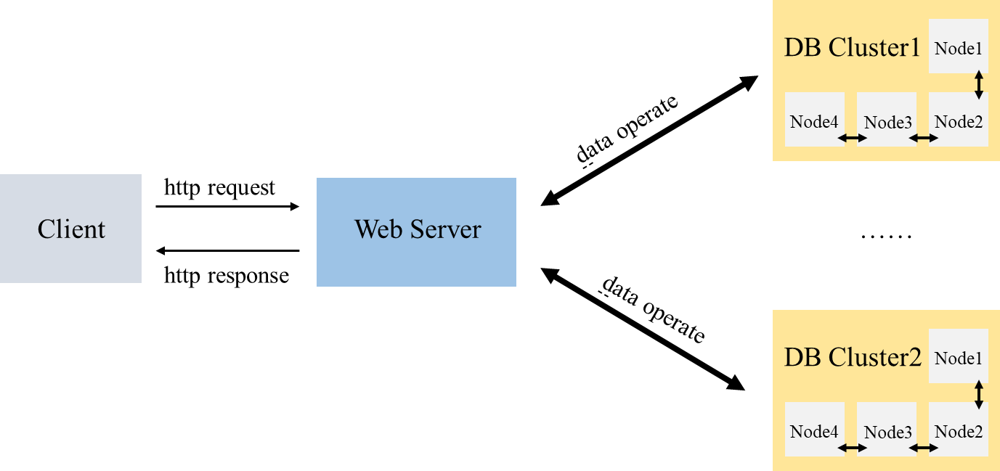
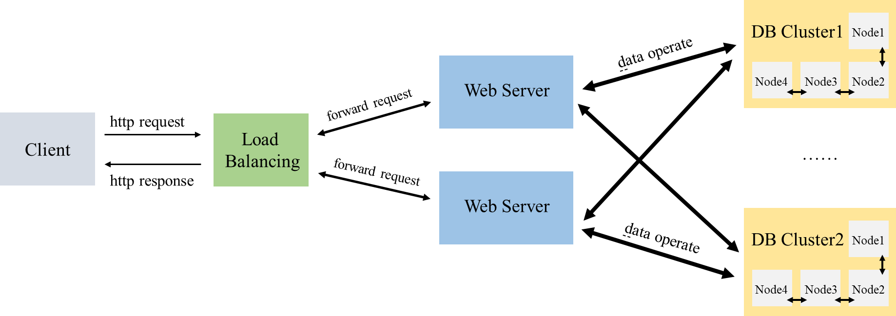

# 云计算Lab4

## **1. Overview**

在 Lab 2 中，我们完成了一个简化的 HTTP/1.1 Web 服务器；

在 Lab 3 中，我们完成了一个简化的 分布式数据库系统。

现在让我们尝试将两者组合并完善，构建一个高性能的分布式选课系统。

我们的目标：

- 运用课程知识与过去的实验项目，构建一个分布式选课系统
- 学习如何提高一个系统的健壮性和可扩展性，尽可能提升其性能

**注意：如果你选择完成 Lab 4，那么将不再需要完成 Lab 3，因为 Lab 4 已经涵盖了 Lab 3 的要求，其中数据库方面的要求，请查看Lab3，我们会根据你的 Lab 4 完成情况对 Lab 3 进行打分。**

---

## 2. Background

你所需要的有关 Http Server 与 Distributed Database 的基础知识都在过去的实验中，如果你忘记了或者想要复习，可以重新查看 [Lab 2](https://github.com/1989chenguo/CloudComputingLabs/tree/master/Lab2) 和 [Lab 3](https://github.com/1989chenguo/CloudComputingLabs/tree/master/Lab3)。

### Dividing databases

随着近些年信息化大发展，越来越多的数据存入了数据库中，而物理服务器的CPU、内存、存储、连接数等资源是有限的，某个时段大量连接同时执行操作，会导致数据库在处理上遇到性能瓶颈。为了解决这个问题，行业先驱门充分发扬了`分而治之`的思想，对大表进行分割，然后实施更好的控制和管理，同时使用多台机器的CPU、内存、存储，提供更好的性能。

其中一种简单的逻辑分割是`垂直分库`。比如我们的数据库中有商品表Products、还有对订单表Orders，还有积分表Scores。接下来我们就可以创建三个数据库，一个数据库存放商品，一个数据库存放订单，一个数据库存放积分。如下图所示：



这样做有以下几个优点：

- 跟随业务进行分割，和最近流行的微服务概念相似，方便解耦之后的管理及扩展。
- 高并发的场景下，垂直拆分使用多台服务器的CPU、I/O、内存能提升性能，同时对单机数据库连接数、一些资源限制也得到了提升。
- 能实现冷热数据的分离。

当然，分库分表在实际应用中是一个十分复杂的设计，在低并发的应用程序中，分库分表的效果并不明显，因此需要根据业务需求，并发承载能力等综合考虑。为了简化这一过程，在实验中，我们仅要求对数据进行垂直分库，即将课程数据和学生信息分别存储到不同的节点中，以此来实现课程数据访问和学生信息访问互不影响的效果。

### Load Balancing

负载平衡（英语：load balancing）是一种电子计算机技术，用来在多个计算机（计算机集群）、网络连接、CPU、磁盘驱动器或其他资源中分配负载，以达到优化资源使用、最大化吞吐率、最小化响应时间、同时避免过载的目的。 使用带有负载平衡的多个服务器组件，取代单一的组件，可以通过冗余提高可靠性。负载平衡服务通常是由专用软件和硬件来完成。 主要作用是将大量作业合理地分摊到多个操作单元上进行执行，用于解决互联网架构中的高并发和高可用的问题。

负载均衡最重要的一个应用是利用多台服务器提供单一服务，对于互联网服务，负载平衡器通常是一个软件程序，这个程序侦听一个外部端口，互联网用户可以通过这个端口来访问服务，而作为负载平衡器的软件会将用户的请求转发给后台内网服务器，内网服务器将请求的响应返回给负载平衡器，负载平衡器再将响应发送到用户，这样就向互联网用户隐藏了内网结构，阻止了用户直接访问后台（内网）服务器，使得服务器更加安全，可以阻止对核心网络栈和运行在其它端口服务的攻击。

当所有后台服务器出现故障时，有些负载平衡器会提供一些特殊的功能来处理这种情况。例如转发请求到一个备用的负载平衡器、显示一条关于服务中断的消息等。负载平衡器使得IT团队可以显著提高容错能力。它可以自动提供大量的容量以处理任何应用程序流量的增加或减少。

为了更好的实现负载均衡器，你可能需要选择一种或几种合适的调度算法。

---

## **3. Your Tasks**

**Basic Version**



在 **basic** 版本中，你只需要运行一个 Web 服务器，与其相连的是多个存储器集群。

对于Web服务器，我们要求：支持高并发，可以同时响应多个客户端发送的请求。

对于存储器集群，我们要求：集群数量不小于2，单个集群之间的通信可以使用 2PC 或 RAFT 协议实现。

> 当存储器集群数量增多时，你可以对存储的数据进行分库存储，如课程中的数据可以存储在 Cluster 1 中，而学生个人信息相关的数据可以存储在 Cluster 2 中。
> 

**Advanced Version**



在advance版本中，你需要运行一个负载均衡器，多个Web服务器以及多个存储器集群。

对于负载均衡器，我们要求：支持高并发，能够动态地选择活跃并且可用的Web服务器，将请求发送至相应节点进行处理。

对于Web服务器和存储器集群，我们要求等同于Basic版本。

## 4. Standardized Format

为了更好的进行测试与评阅，我们将对实验过程中的一些数据格式进行标准规定，请确保你实现的最终系统在这些对外接口上是我们的标准一致的。

在请求体和响应体中，我们采用JSON格式进行通信。请求体根据请求内容决定，而响应体包含了特定的数据结构，分别为`code`，`data`和`msg`。其中`code`表示状态码，200为正常响应，其他为错误响应，可以根据实际情况返回不同的非零值。`data`表示响应对象，里面包含响应结果，错误情况下为空。`msg`表示响应消息，正常情况下一般为ok，错误情况下根据实际值返回错误消息。

> 除了特定的 api 之外，Web 服务器仍需要支持静态文件访问等基本功能（如支持显示 html 页面，非法 path 返回 404 页面等），在此略去介绍，具体信息可参考 Lab 2。
> 

> 我们对 api 的设计进行了非常多的简化，现实中将会远比它们复杂，你可以使用要求以外的 path 扩展你的系统，如：你可以自行设计报错信息。
> 

### 4.1 Web Server

一个完整的选课系统需要包含众多功能，为了降低复杂性，我们将其抽象为查询课程，选中课程和退选课程这几个模块。

1. `/api/search/course`

> 介绍：主要用于查询课程信息，相关的参数使用 `query` 携带，查询后给出的数据至少需要包含课程的 编号，名称，容量和已选人数。
> 

> 方法：GET
> 

> 参数：id=[course_id]
> 
> 
> > 课程编号仅由 `[a-zA-Z0-9]`组成，不含有特殊字符。
> > 

> 响应体：
> 
> 
> ```json
> {
>       "code": 200,
>       "data": {
>           "id": course_id,  // 课程id
>           "name": course_name , // 课程
>           "capacity": capacity , // 课程容量
>           "selected": selected // 已选人数
>       },
>       "msg": "ok"
> }
> ```
> 

2. `/api/search/all`

> 介绍：与查询单个课程类似，但其 `data`字段的值从单个课程信息变为了包含所有课程信息的数组。
> 

> 方法：GET
> 

> 响应体：
> 
> 
> ```json
> {
>       "code": 200,
>       "data": [{
>           "id": course_id, // 课程id
>           "name": course_name , // 课程
>           "capacity": capacity , // 课程容量
>           "selected": selected // 已选人数
>       },{
>           "id": course_id,
>           "name": course_name , // 课程
>           "capacity": capacity , // 课程容量
>           "selected": selected  // 已选人数
>           },
>           ...
>       ],
>       "msg": "ok"
> }
> ```
> 

3. `/api/search/student`

> 介绍：主要用于查询学生所选课程信息，相关的参数使用 `query` 携带
> 

> 方法：GET
> 

> 参数：stuid=[student_id]
> 
> 
> > 学生学号仅由 `[a-zA-Z0-9]`组成，不含有特殊字符。
> > 

> 响应体：
> 
> 
> ```json
> {
>       "code": 200,
>       "data": {
>           "stuid": student_id, // 学号
>           "name": student_name , // 学生姓名
>           "course": [{ // 学生选的课程数组
>               "id": course_id,
>               "name": course_name , // 课程
>               },{
>               "id": course_id,
>               "name": course_name , // 课程
>               },
>               ...
>           ]
>       },
>       "msg": "ok"
> }
> ```
> 
> > 如果学生未选课程， `data.course = []`即可。
> > 

4. `/api/choose`

> 介绍：主要用于进行选课操作，相关的参数使用 `http request body`携带
> 

> 方法：POST
> 

> 请求体：
> 
> 
> ```json
> {
>       "stuid": student_id, // 学生学号
>       "course_id": course_id // 课程编号
> }
> ```
> 
> > 当需要进行选课操作时，`payload` 应至少包含 学生学号，课程编号。
> > 

> 响应体：
> 
> 
> ```json
> {
>       "code": 200,
>       "data": [],
>       "msg": "ok"
> }
> ```
> 
> > 对于 payload 格式或数据非法，无法查询到相关信息，课程已满 等错误情况，返回包含错误信息的 JSON 对象即可。
> > 

5. `/api/drop`

> 介绍：主要用于进行退选操作，相关的参数使用 `http request body`携带
> 

> 方法：POST
> 

> 请求体：
> 
> 
> ```json
> {
>       "stuid": student_id, // 学生学号
>       "course_id": course_id // 课程编号
> }
> ```
> 
> > 当需要进行选课操作时，`payload` 应至少包含 学生学号，课程编号。
> > 

> 响应体：
> 
> 
> ```json
> {
>       "code": 200,
>       "data": [],
>       "msg": "ok"
> }
> ```
> 
> > 对于 payload 格式或数据非法，无法查询到相关信息，该学生没有选择这门课等错误情况，返回包含错误信息的 JSON 对象即可。
> > 

### 4.2 Store Server

### Command Lines Arguments

由于我们系统使用了默认数据，所以你的存储器应该在启动时，对这些数据进行读取。

> 默认数据可以在 data/ 文件夹中找到。
> 

> 其余说明请参考 Lab 3。
> 

### Database Tables

数据库的基础格式是关系型数据库，你也可以根据需要增添修改数据的类型，也可以选择设计新类型的数据库，但必须保证通过数据库可以正常完成需要的功能。

> 默认数据可以在 data/ 文件夹中找到。
> 

### Course

| id(key) - string | name - string | capacity - int | selected - int |
| --- | --- | --- | --- |
| "CS06142" | "云计算技术" | 120 | 120 |

### Student

| id(key) - string | name - string |
| --- | --- |
| "211926010111" | "张三" |

### Course Selection

| Course id - string | Student id - string |
| --- | --- |
| "CS06142" | "211926010111" |

### Commands

正常情况下，用户访问数据仅通过前端的 HTTP Web 服务器，而数据查询由 Web 服务器与数据库集群进行交互。

以下给出的数据库命令**仅供参考**，你可以选择自己实现一个满足相同基本功能的命令集。

### Check Courses Capacity

发送 `GET Course [course id]`, e.g., `GET Course CS06142`；

返回 `[course id] [course name] [course capacity] [selected number]`, e.g., `CS06142 云计算技术 120 120`

特别的，可以一次查询所有的课程最大容量信息:

发送 `GET Course all`, e.g., `GET Course all`；

返回 **多行** `[course id] [course name] [course capacity] [selected number]`, e.g., `CS04008 计算机网络 90 80\nCS06142 云计算技术 120 120`。

### Check Student Selected Courses

发送 `GET Student Courses [student id]`, e.g., `GET Student Courses 211926010111`；

返回 **多行** `[course id] [course name]`, e.g., `CS04008 计算机网络\nCS06142 云计算技术`。

### Choose a Course

发送 `ADD Student Course [student id] [course id]`, e.g., `ADD Student Course 211926010111 CS06142`；

如果成功，返回 `+OK`; 如果失败，返回 `-ERROR`。

### Drop a Course

发送 `DEL Student Course [student id] [course id]`, e.g., `DEL Student Course 211926010111 CS06142`；

如果成功，返回 `+OK`; 如果失败，返回 `-ERROR`。

### 4.3 **Load Balancer**

为了更好地统一测试，我们需要你的负载均衡器采用标准的配置文件启动，例如，你可以这样将所有的Web服务的地址和端口传给负载均衡器，由负载均衡器动态的转发请求到这些Web服务上：

```
# web_servers.conf
# 每一行都是一个内部web服务进程的监听地址和端口
127.0.0.1 8081
127.0.0.1 8082
127.0.0.1 8083
127.0.0.1 8084
```

## 5. Test

默认情况下，我们将在 Linux Ubuntu 20.04 x64 服务器进行测试。

我们预期的测试和评分项目有：

- API功能实现：上述每个API均为1分（**5分**）
- 存储节点容灾测试：随机终止存储节点服务，接口运行情况（**3分**）
- 负载均衡实现：通过负载均衡器对外提供接口服务，并且Web服务能够容灾（**1分**）
- 性能测试：在高并发下、动态切换的情况下，系统的承载能力，根据所有小组的测试情况进行内部评比得分（1**分**）

为了标准化测试，你的系统在运行上，需要满足一下条件：

1. 注意文件结构，不同模块源代码处于不同文件夹中（我们会检查你的源代码）
2. 项目的根目录下可以使用 `make` 命令直接编译所有模块
3. 可执行文件分为 Web 服务器 和 存储器集群两个部分，其中
    - Web 服务器可执行文件为 `web-server`，支持 `-ip`, `-port`, `-config_path` 等命令行参数，例如`./web-server --ip 127.0.0.1 --port 8080 --config_path ./conf/store_servers.conf`
    - 存储器 可执行文件为 `store-server`，支持 `-config_path` 等命令行参数，并使用配置文件 `coordinator.conf` 或 `participant.conf` 进行配置，具体细节请查看Lab3。测试中，每个集群的存储服务器数量为 4，2pc和raft任选一种实现，例如：
    
    ```
    # 启动存储服务器集群1（该集群主要存储 学生-选课 数据） - 2pc
    $ ./store-server --config_path ./conf/coordinator1.conf
    $ ./store-server --config_path ./conf/participant101.conf
    $ ./store-server --config_path ./conf/participant102.conf
    $ ./store-server --config_path ./conf/participant103.conf
    
    # 启动存储服务器集群2（该集群主要存储 课程-选课人数 数据） - raft
    $ ./store-server --config_path ./conf/store201.conf
    $ ./store-server --config_path ./conf/store202.conf
    $ ./store-server --config_path ./conf/store203.conf
    $ ./store-server --config_path ./conf/store204.conf
    ```
    
    - 如果你实现了 `Load Balancer`，其可执行文件请命名为 `load-balancer`，支持 `-ip --port --web_config_path -store_config_path`   等命令行参数。例如
    
    ```
    # 启动负载均衡器
    $ ./load-balancer --ip 127.0.0.1 --port 8080 --store_config_path ./conf/store_servers.conf --web_config_path ./conf/web_servers.conf
    
    # 启动web服务器集群
    $ ./web-server01 --ip 127.0.0.1 --port 8081 --config_path ./conf/store_servers.conf
    $ ./web-server02 --ip 127.0.0.1 --port 8082 --config_path ./conf/store_servers.conf
    $ ./web-server02 --ip 127.0.0.1 --port 8083 --config_path ./conf/store_servers.conf
    $ ./web-server02 --ip 127.0.0.1 --port 8084 --config_path ./conf/store_servers.conf
    ```
    

> 可执行文件与配置文件的要求可以参考 Lab2, Lab 3。
> 

4.每次运行系统，都将先启动多个存储器集群中的每个存储服务器，随后启动多个 Web 服务器，最后再启动 Load Balancer（如果需要），请保证每个可执行文件都能正常运行。

类似之前的实验，我们提供了[测试程序](https://github.com/LabCloudComputing)，请仔细阅读 Lab 4 实验文档和测试程序文档后使用。

---

## 6. Lab submission

将你的代码提交到 `/Lab4/` 文件夹，并编写 `Makefile` 确保可以直接使用 `make` 命令编译所有需要的可执行文件。

考虑到 `Lab 4` 实现完整系统较为复杂，验收可能会存在额外问题，请在提交代码的同时，编写一份 `intro.md` ，并添加一些说明，如：如何编译，如何运行你的程序；是否运用了其他依赖库，如何安装依赖；如何管理数据库，实现数据分块等。

---

## 7. Grading standards

完成所有 Basic 版本的要求，你将获得 8 分；

完成所有 Advanced 版本的要求，你将获得 10 分。

如果你有部分功能没有实现，将根据你的完成情况进行细化打分。

**此分数不包含 Lab 3，Lab 3 的分数会根据 Lab 4 完成情况另外获得。**
