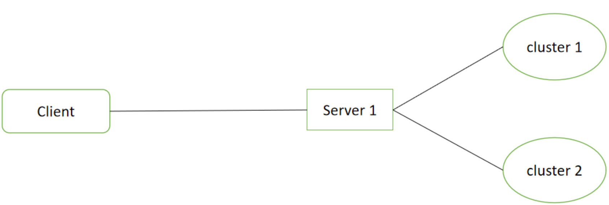
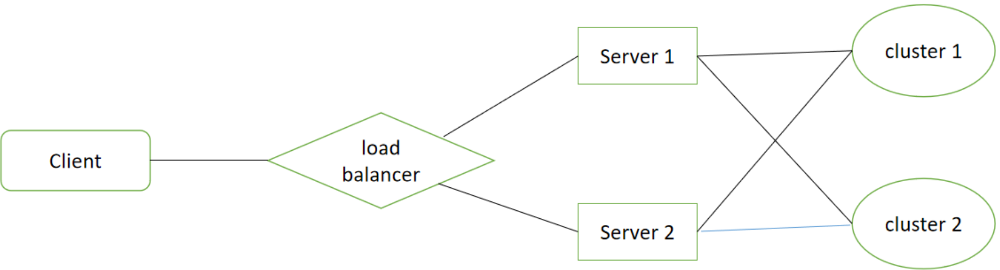

# Lab4: A High Performance Course Selection System

## 1. Overview

在 Lab 2 中，我们完成了一个简化的 HTTP/1.1 Web 服务器；

在 Lab 3 中，我们完成了一个简化的 分布式数据库系统。

现在让我们尝试将两者组合并完善，构建一个高性能的分布式选课系统。

我们的目标：
 - 运用课程知识与过去的实验项目，构建一个分布式选课系统
 - 学习如何提高一个系统的健壮性和可扩展性，尽可能提升其性能

**注意：如果你选择完成 Lab 4，那么将不再需要完成 Lab 3，因为 Lab 4 已经涵盖了 Lab 3 的要求。我们会根据你的 Lab 4 完成情况对 Lab 3 进行打分。**

---

## 2. Background

你所需要的有关 Http Server 与 Distributed Database 的基础知识都在过去的实验中，如果你忘记了或者想要复习，可以重新查看 [Lab 2](./lab2.md) 和 [Lab 3](./lab3.md)。


### Load Balancing

负载平衡（英语：load balancing）是一种电子计算机技术，用来在多个计算机（计算机集群）、网络连接、CPU、磁盘驱动器或其他资源中分配负载，以达到优化资源使用、最大化吞吐率、最小化响应时间、同时避免过载的目的。 使用带有负载平衡的多个服务器组件，取代单一的组件，可以通过冗余提高可靠性。负载平衡服务通常是由专用软件和硬件来完成。 主要作用是将大量作业合理地分摊到多个操作单元上进行执行，用于解决互联网架构中的高并发和高可用的问题。

负载均衡最重要的一个应用是利用多台服务器提供单一服务，对于互联网服务，负载平衡器通常是一个软件程序，这个程序侦听一个外部端口，互联网用户可以通过这个端口来访问服务，而作为负载平衡器的软件会将用户的请求转发给后台内网服务器，内网服务器将请求的响应返回给负载平衡器，负载平衡器再将响应发送到用户，这样就向互联网用户隐藏了内网结构，阻止了用户直接访问后台（内网）服务器，使得服务器更加安全，可以阻止对核心网络栈和运行在其它端口服务的攻击。

当所有后台服务器出现故障时，有些负载平衡器会提供一些特殊的功能来处理这种情况。例如转发请求到一个备用的负载平衡器、显示一条关于服务中断的消息等。负载平衡器使得IT团队可以显著提高容错能力。它可以自动提供大量的容量以处理任何应用程序流量的增加或减少。

为了更好的实现负载均衡器，你可能需要选择一种或几种合适的调度算法。

---

## 3. Your Tasks

### Basic Version



对于 basic 版本，你只需要运行一个 Web 服务器，与其相连的是多个存储器集群。

对于 Web 服务器，我们要求：支持高并发，可以同时响应多个客户端发送的请求。

对于 存储器集群，我们要求：集群数量不小于2，单个集群之间的通信可以使用 2PC 或 RAFT 协议实现。

> 当存储器集群数量增多时，你需要对存储的数据进行分块，如 Course 中的部分数据可以存储在 Cluster 1 中，另一部分相关的数据可以存储在 Cluster 2 中。

### Advanced Version



对比 basic 版本，你需要在 basic 版本的基础上，同时运行多个 相同功能的 Web 服务器，并实现一个自己的负载均衡器，它能够对来自客户端的请求进行分流，向合适 Web 服务器转发客户端请求。

---

## 4. Standardized Format

为了更好的进行测试与评阅，我们将对实验过程中的一些数据格式进行标准规定，请确保你实现的最终系统在这些对外接口上是我们的标准一致的。

### 4.1 Web Server

Web 服务器对外与 Clients 进行交互，负责解析来自 Clients 的请求，并根据需要向下查询数据库获取数据后响应给 Clients。

#### Command Line Arguments

由于你的 Web 服务器需要连接上存储服务器，同时为了更好地统一测试，我们需要你的 Web 服务器采用标准的配置文件启动，如：

`web-server --ip 127.0.0.1 --port 8080 --config_path store_servers.conf`

对于 `store_servers.conf`，需要包含将服务器连接的存储服务器的信息，如：

对 `2pc`，

```
127.0.0.1:8081
```

对 `raft`，需要的存储服务器可能会有多个，

```
127.0.0.1:8081
127.0.0.1:8082
127.0.0.1:8083
127.0.0.1:8084
```

如果你同时使用了多个集群，请用空行分隔不同集群，如：

```
127.0.0.1:8081

127.0.0.1:8091
127.0.0.1:8092
127.0.0.1:8093
127.0.0.1:8094
```

#### GET

对于 GET，至少应包含如下功能：

- 获取某项课程信息 `/api/search/course?id=[course id]`
- 获取所有课程信息 `/api/search/course?all`
- 获取某个学生的所选课程 `/api/search/student?id=[student id]`

> 除了特定的 `api` 之外，Web 服务器仍需要支持静态文件访问等基本功能（如支持显示 html 页面，非法 path 返回 404 页面等），在此略去介绍，具体信息可参考 Lab 2。

> 我们对 `api` 的设计进行了非常多的简化，现实中将会远比它们复杂，你可以使用要求以外的 path 扩展你的系统，如：你可以自行设计报错信息。 

##### /api/search/course

该 api 主要用于查询课程信息，相关的参数使用 `query string` 携带。

当需要查询某个课程时，通过 `course id` 代表课程；

> 课程编号仅由 `[a-zA-Z0-9]` 组成，不含有特殊字符。

查询后给出的数据至少需要包含课程的 编号，名称，容量和已选人数，这些数据包裹在 JSON 格式对象中，形式如下：

| query string | status code | response content type | response body | 
| --- | --- | --- | --- |
| id=[course id] | 200 | application/json | {"status":"ok","data":{"id":`course id`,"name": `course name`,"capacity":`capacity`,"selected":`selected`} |

特别的，如果需要查询全部课程，`query string` 中可选择携带 `all`。

与查询单个课程类似，但其 `data` 字段的值从单个课程信息变为了包含所有课程信息的数组。

| query string | status code | response content type | response body | 
| --- | --- | --- | --- |
| all | 200 | application/json | {"status":"ok", "data":[{"id":`course id`,"name": `course name`,"capacity":`capacity`,"selected":`selected`}, ...] |

对于 query string 格式或数据非法，无法查询到相关信息 等错误情况，返回包含错误信息的 JSON 对象即可。

| case | status code | response content type | response body |
| --- | --- | --- | --- |
| invalid or can't get result | 403 | application/json | {"status":"error", "message":`error message`} |

##### /api/search/student

该 api 主要用于查询学生所选课程信息，相关的参数使用 `query string` 携带。

当需要查询某个学生相关信息时，通过 `student id` 代表课程；

> 学生学号编号仅由 `[0-9]` 组成，不含有特殊字符。

查询后给出的数据至少需要包含学生的 学号，姓名，所选的课程编号，这些数据包裹在 JSON 格式对象中，形式如下：

| query string | status code | response content type | response body | 
| --- | --- | --- | --- |
| id=[student id] | 200 | application/json | {"status":"ok","data":{"id":`student id`,"name": `student name`,"courses":[{"id"=`course id a`, "name": `course name a`},...} |

> 如果学生未选课程， `data.course = []` 即可。

对于 query string 格式或数据非法，无法查询到相关信息 等错误情况，返回包含错误信息的 JSON 对象即可。

| case | status code | response content type | response body |
| --- | --- | --- | --- |
| invalid or can't get result | 403 | application/json | {"status":"error", "message":`error message`} |

#### POST

对于 POST，至少应包含如下功能：

- 学生进行选课 `/api/choose`
- 学生进行退课 `/api/drop`

##### /api/choose

该 api 主要用于进行选课操作，相关的参数使用 `http request body` 携带。

当需要进行选课操作时，`payload` 应至少包含 学生学号，课程编号；

操作后给出的数据至少需要包含操作的结果，这些数据包裹在 JSON 格式对象中，形式如下：

| response content type | payload | status code | response content type | response body | 
| --- | --- | --- | --- | --- | 
| application/json | {"student_id":`student id`,"course_id":`course id`} | 200 | application/json | {"status":"ok"} |

对于 payload 格式或数据非法，无法查询到相关信息，课程已满 等错误情况，返回包含错误信息的 JSON 对象即可。

| case | status code | response content type | response body |
| --- | --- | --- | --- |
| invalid or can't get result | 403 | application/json | {"status":"error", "message":`error message`} |

##### /api/drop

该 api 主要用于进行退课操作，相关的参数使用 `http request body` 携带。

当需要进行选课操作时，`payload` 应至少包含 学生学号，课程编号；

操作后给出的数据至少需要包含操作的结果，这些数据包裹在 JSON 格式对象中，形式如下：

| response content type | payload | status code | response content type | response body | 
| --- | --- | --- | --- | --- | 
| application/json | {"student_id":`student id`,"course_id":`course id`} | 200 | application/json | {"status":"ok"} |

对于 payload 格式或数据非法，无法查询到相关信息，课程已满 等错误情况，返回包含错误信息的 JSON 对象即可。

| case | status code | response content type | response body |
| --- | --- | --- | --- |
| invalid or can't get result | 403 | application/json | {"status":"error", "message":`error message`} |

### 4.2 Store Server

#### Command Lines Arguments

由于我们系统使用了默认数据，所以你的存储器应该在启动时，对这些数据进行读取。

> 默认数据可以在 `data/` 文件夹中找到。

为此，我们要求你的配置文件内新增两行配置指令，用于读取 course 与 student 的信息。

例如：

对 2pc 版本，

```
course ./data/courses.txt
student ./data/students.txt
mode participant
participant_info 127.0.0.1:8002
coordinator_info 127.0.0.1:8001
```

对 raft 版本，

```
course ./data/courses.txt
student ./data/students.txt
mode participant
participant_info 127.0.0.1:8002
coordinator_info 127.0.0.1:8001
```

> 其余说明请参考 Lab 3。

#### Database Tables

数据库的基础格式是关系型数据库，你也可以根据需要增添修改数据的类型，也可以选择设计新类型的数据库，但必须保证通过数据库可以正常完成需要的功能。

> 默认数据可以在 `data/` 文件夹中找到。

##### Course

| id(key) | name | capacity | selected |
| --- | --- | --- | --- |
| string | string | int | int |
| "CS06142" | "云计算技术" | 120 | 120 |

##### Student

| id(key) | name |
| --- | --- |
| string | string |
| "211926010111" | "张三" |

##### Course Selection

| Course id(key-1) | Student id(key-2) |
| --- | --- |
| string | string |
| "CS06142" | "211926010111" |

#### Commands

正常情况下，用户访问数据仅通过前端的 HTTP Web 服务器，而数据查询由 Web 服务器与数据库集群进行交互。

以下给出的数据库命令仅供参考，你可以选择自己实现一个满足相同基本功能的命令集。

##### Check Courses Capacity

发送 `GET Course [course id]\n`, e.g., `GET Course CS06142\n`；

返回 `[course id] [course name] [course capacity] [selected number]\n`, e.g., `CS06142 云计算技术 120 120\n`

特别的，可以一次查询所有的课程最大容量信息:

发送 `GET Course all\n`, e.g., `GET Course all\n`；

返回 **多行** `[course id] [course name] [course capacity] [selected number]\n`, e.g., `CS04008 计算机网络 90 80\nCS06142 云计算技术 120 120\n`。

##### Check Student Selected Courses

发送 `GET Student Courses [student id]\n`, e.g., `GET Student Courses 211926010111\n`；

返回 **多行** `[course id] [course name]\n`, e.g., `CS04008 计算机网络\nCS06142 云计算技术\n`。

##### Choose a Course

发送 `ADD Student Course [student id] [course id]\n`, e.g., `ADD Student Course 211926010111 CS06142\n`；

如果成功，返回 `+OK`; 如果失败，返回 `-ERROR`。

##### Drop a Course

发送 `DEL Student Course [student id] [course id]\n`, e.g., `DEL Student Course 211926010111 CS06142\n`；

如果成功，返回 `+OK`; 如果失败，返回 `-ERROR`。

### 3.3 Load Balancer

#### Command Line arguments

为了更好地统一测试，我们需要你的负载均衡器采用标准的配置文件启动，如：

`load-balancer --ip 127.0.0.1 --port 8080 --config_path load-balancer.conf`

对于 `load-balancer.conf`，需要包含将接受负载均衡的 Web 服务器信息，如：

```
127.0.0.1:8080
127.0.0.1:8081
```

---

## 5. Test

默认情况下，我们将在 Linux Ubuntu 18.04 x64 服务器进行测试。

我们预期的测试项目有：

- 正确性测试，检查你的系统能否在低并发下和简单异常（如某数据库网络故障）下正常完成功能；
- 高性能压力测试，检查你的系统能否在频繁动态发生异常的情况下正常完成功能，并检测其对于客户端提供服务的能力。

为了标准化测试，你的系统在运行上，需要满足一下条件：

1. 注意文件结构，不同模块源代码处于不同文件夹中（我们会检查你的源代码）

2. 项目的根目录下可以使用 `make` 命令直接编译所有模块
   
3. 可执行文件分为 Web 服务器 和 存储器集群两个部分，其中
    -  Web 服务器可执行文件为 `web-server`，支持 `--ip`, `--port`, `--config_path` 等命令行参数 
    -  存储器 可执行文件为 `store-server`，支持 `--config_path` 等命令行参数，并使用配置文件 `coordinator.conf` 或 `participant.conf` 进行配置
    - 测试中，每个集群的存储服务器数量为 4。
    - 如果你实现了 `Load Balancer`，其可执行文件请命名为 `load-balancer`，支持 `--ip --port --config_path` 等命令行参数

> 可执行文件与配置文件的要求可以参考 Lab2, Lab 3。

4. 每次运行系统，都将先启动多个存储器集群中的每个存储服务器，随后启动多个 Web 服务器，最后再启动 Load Balancer（如果需要），请保证每个可执行文件都能正常运行。

类似之前的实验，我们提供了[测试程序](https://github.com/LabCloudComputing/course-system-tester)，请仔细阅读 Lab 4 实验文档和测试程序文档后使用。

---

## 6. Lab submission

将你的代码提交到 `/Lab4/` 文件夹，并编写 `Makefile` 确保可以直接使用 `make` 命令编译所有需要的可执行文件。

考虑到 `Lab 4` 实现完整系统较为复杂，验收可能会存在额外问题，请在提交代码的同时，编写一份 `intro.md` ，并添加一些说明，如：如何编译，如何运行你的程序；是否运用了其他依赖库，如何安装依赖；如何管理数据库，实现数据分块等。

---

## 7. Grading standards

完成所有 Basic 版本的要求，你将获得 8 分；

完成所有 Advanced 版本的要求，你将获得 10 分。

如果你有部分功能没有实现，将根据你的完成情况进行细化打分。

**此分数不包含 Lab 3，Lab 3 的分数会根据 Lab 4 完成情况另外获得。**
